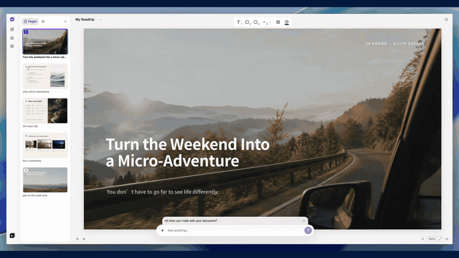
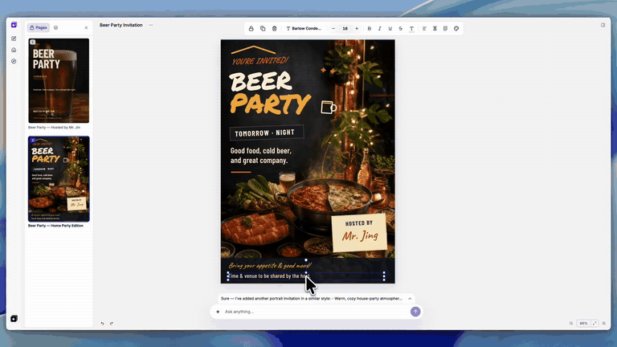
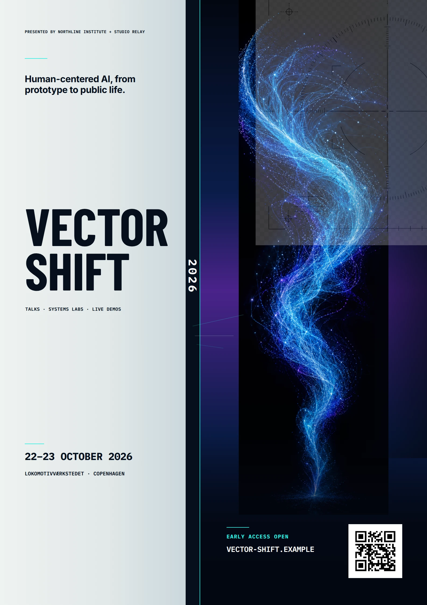
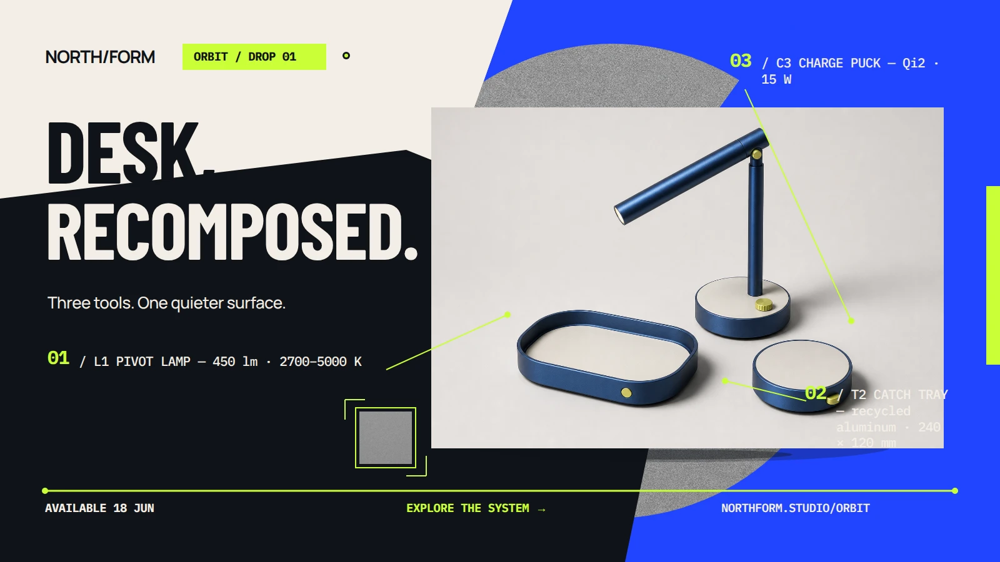
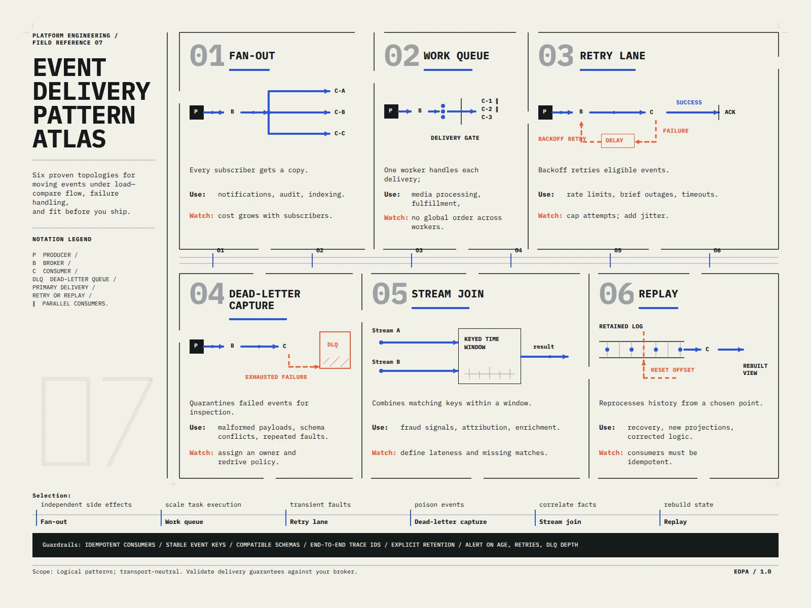
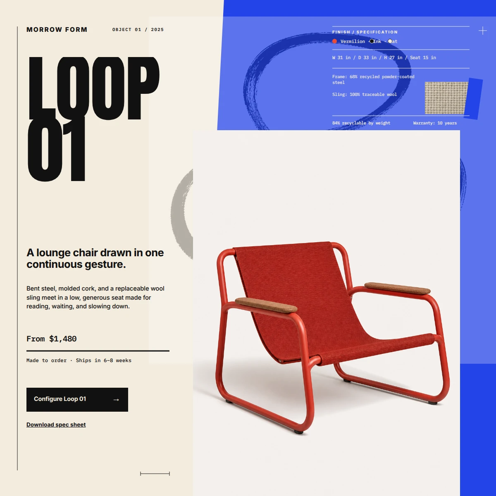
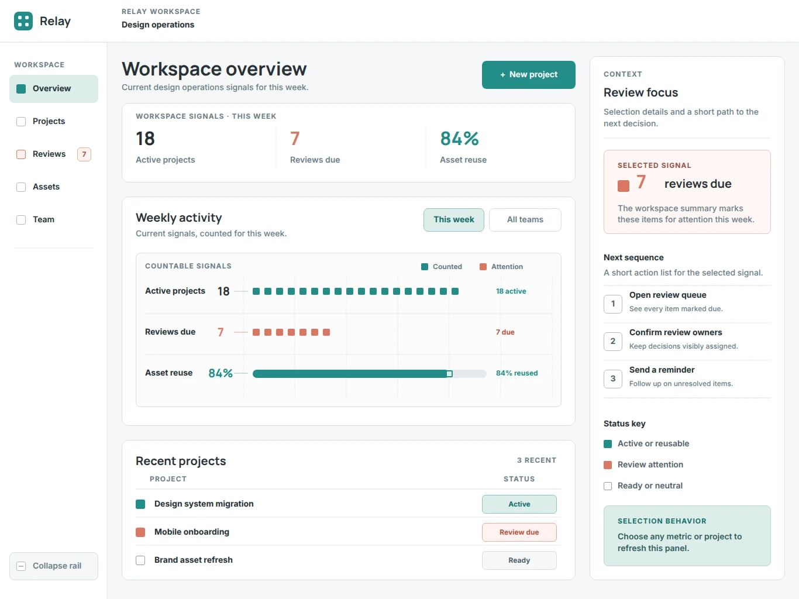
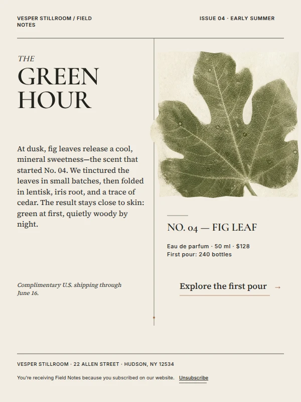
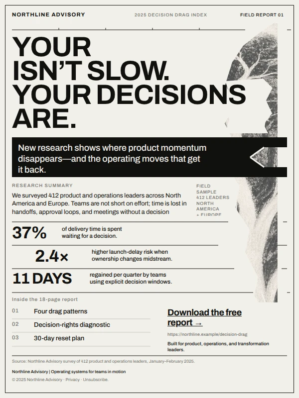

<p align="center">
  
</p>

<h1 align="center">StarryKit Plugin</h1>

<p align="center">
  Turn an idea into a polished, editable presentation or visual design—without leaving your AI agent.
</p>

<p align="center">
  <a href="README.zh-CN.md">简体中文</a> ·
  <a href="#overview">Overview</a> ·
  <a href="#install">Install</a> ·
  <a href="#see-it-in-action">Demos</a> ·
  <a href="#use-cases">Use cases</a> ·
  <a href="docs/README.md">Manual setup</a> ·
  <a href="https://starrykit.com">Website</a>
</p>

## Overview

StarryKit gives your AI agent a complete visual design workflow. Start with an idea, image, website, or source file; create a polished visual document; refine every element; and export it in the format you need. You do not need to find the right template first—your references become the starting point.

| Feature | What it means |
| --- | --- |
| **Editable** | Every design stays editable in StarryKit—from individual elements to complete pages. |
| **Perfect export** | Export complete documents or selected pages cleanly to PPTX, PDF, SVG, PNG, JPEG, HTML, or Google Slides. |
| **Import & recreate** | Provide an image, a website, or a source file such as `design.md`. StarryKit uses it as a visual reference and recreates it as an editable design—no template required. |
| **1000+ Prompts** | Explore [1,000+ ready-to-use prompts](https://starrykit.com/explore) and visual ideas, then open one in StarryKit to make it your own. |

## Install

Install StarryKit for your preferred agent host.

### Claude Code

```bash
claude plugin marketplace add StarryKit/starrykit-plugin
claude plugin install starrykit-plugin@starrykit
```

### Codex

```bash
codex plugin marketplace add StarryKit/starrykit-plugin
codex plugin add starrykit-plugin@starrykit
```

### Cursor

While the Marketplace listing is under review, install the complete Plugin locally:

```bash
git clone https://github.com/StarryKit/starrykit-plugin.git ~/.cursor/plugins/local/starrykit-plugin
```

Restart Cursor or run **Developer: Reload Window**. See the [Cursor installation guide](docs/cursor/README.md) for OAuth and verification.

### Grok Build

```bash
grok plugin install StarryKit/starrykit-plugin --trust
```

The plugin installs the StarryKit Skill and configures the Hosted MCP. Browser OAuth opens when your agent connects for the first time. For other hosts or manual setup, see the [installation guides](docs/README.md).

## See it in action

### Create and Refine with AI



### Edit Manually and Export



## Use Cases

### Presentation

| Prompt | Showcase |
| --- | --- |
| **Product catalog**<br><pre><code>Create a six-page launch catalog for a&#10;modular acoustic collection. Make it editorial,&#10;tactile, and specification-ready.</code></pre> |  |
| **Technical launch**<br><pre><code>Turn this incident-response brief into a&#10;high-contrast launch deck built around one clear&#10;proof point: verified cause in 11 minutes.</code></pre> |  |
| **Strategy proposal**<br><pre><code>Build an executive strategy deck for a 90-day&#10;shade pilot. Keep it warm, editorial, and&#10;grounded in one clear public-space outcome.</code></pre> |  |

### Poster

| Prompt | Showcase |
| --- | --- |
| **Open studios**<br><pre><code>Create a stark monochrome poster for an&#10;open-studios night. Make unfinished work feel&#10;intentional, physical, and inviting.</code></pre> |  |
| **AI summit**<br><pre><code>Design a futuristic event poster for a&#10;human-centered AI summit, pairing precise&#10;typography with an atmospheric signal visualization.</code></pre> |  |
| **Product showcase**<br><pre><code>Turn this four-product brief into a clean catalog&#10;poster for a weekend tools showcase, with price&#10;and event details easy to scan.</code></pre> |  |

### Social Media

| Prompt | Showcase |
| --- | --- |
| **Product drop**<br><pre><code>Create a bold social launch graphic for a modular&#10;desk-accessory collection, using numbered&#10;callouts and electric color.</code></pre> |  |
| **Educational carousel**<br><pre><code>Design a clean social carousel that teaches six&#10;typography styles every designer should know.</code></pre> |  |
| **Thought leadership**<br><pre><code>Create a high-impact social graphic for a report&#10;on five weak signals reshaping product strategy.</code></pre> |  |

### More from the Gallery

| Web | UI | Diagram |
| :---: | :---: | :---: |
|  |  |  |
| **Web** | **UI** | **Card** |
|  |  |  |
| **Infographic** | **Email** | **Email** |
|  |  |  |

[Explore more work in the StarryKit Gallery.](https://starrykit.com/gallery)

---

<sub>Historical note: this repository previously hosted Starry Slides. Its final source snapshot remains available on the <a href="https://github.com/StarryKit/starrykit-plugin/tree/archive/starry-slides-v0.1.38">archive/starry-slides-v0.1.38</a> branch.</sub>
